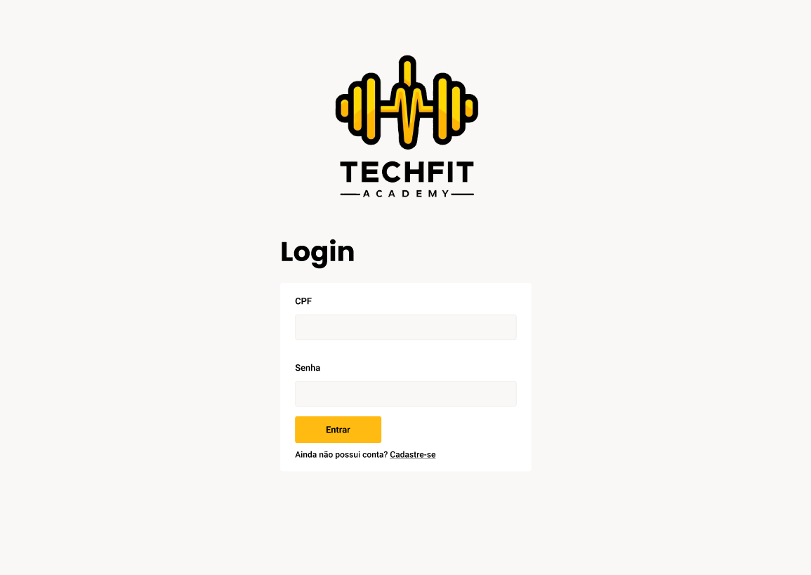
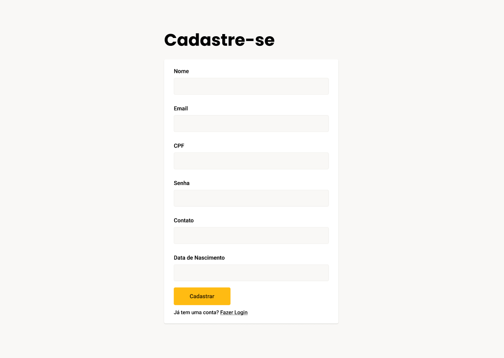
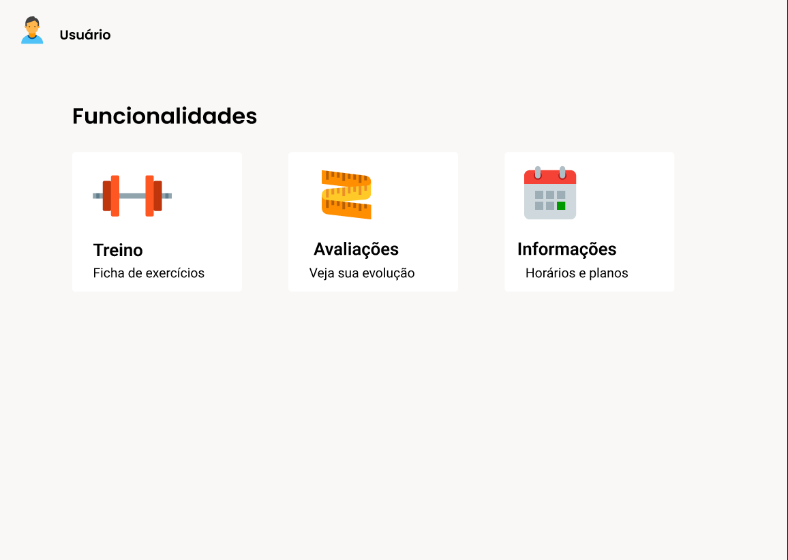
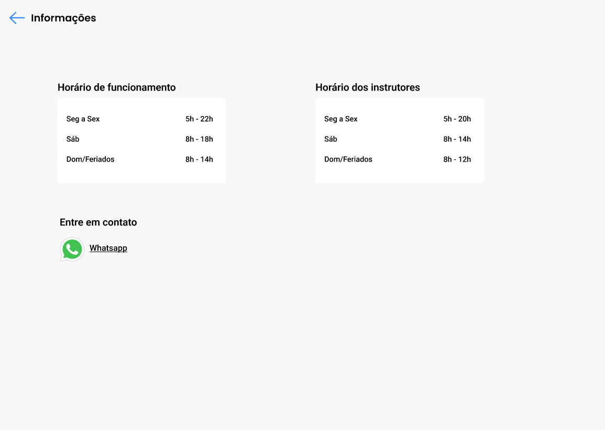
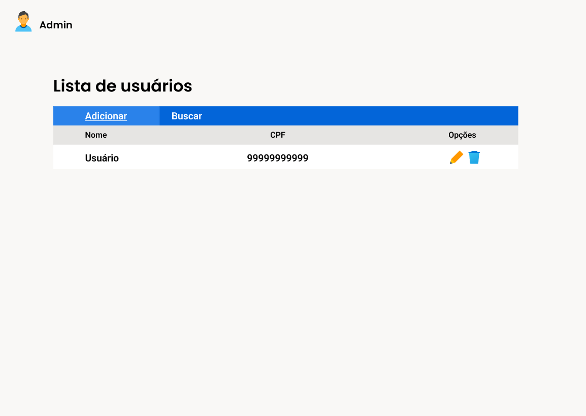

# Engenharia de Software-2024.1 | Universidade Federal do Tocantins - Palmas

---
## TechFit Academy

---
#### Curso: Bacharelado em Ciência da Computação
#### Professor: Edeilson Milhomem da Silva
#### Monitor: João Gabriel Alves de Souza
#### Time: Daniel Barbosa de Assis Costa, Danilo Oliveira Maciel, Pablo Pereira Brito, Tarciso Filho Miranda Dias

---
## Introdução 

O projeto "TechFit Academy" visa disponibilizar aos usuários acesso aos serviços online da academia. Tendo em vista uma forma de facilitar o acesso aos serviços disponíveis na academia, o projeto disponibiliza acesso básico aos serviços, dentro os quais estão: Visualizar avaliações físicas, visualizar fichas de treinos e acesso a informações

---
## Relatórios de Gestão
- [1ª Iteração](Relatorios%20de%20Gestao/Relatórios%20de%20Gestão%20-%20Iteração%20%231.pdf)
- [2ª Iteração](Relatorios%20de%20Gestao/Relatórios%20de%20Gestão%20-%20Iteração%20%232.pdf)

---
## 1ª Iteração - (03/04/2024 - 16/04/2024)

Nesta primeira iteração, temos como objetivo dar o primeiro passo no projeto. Desse modo, faremos a 'Tela home' da forma como foi esboçada no event storming. Entretanto, como o objetivo dessa atividade é construir a parte de valor do projeto, tomaremos como se já tivesse sido feita a parte de autenticação, ou seja, poderemos fazer um cadastro diretamente pelo banco de dados mas pularemos a autenticação.

- Se for superuser(admin):
  - Tela home com operação create para: adicionar novo usuário com '.pdf' da avaliação física e ficha de treino. Autor: [Tarciso Filho](https://github.com/tarcisof) Revisado por @assisDaniel
  - Tela home com operação update para: atualizar dados do usuário e arquivos '.pdf' da avaliação física e ficha de treino. Autor: [Daniel Barbosa](https://github.com/assisDaniel) Revisado por @httpablo
  - Tela home com operação delete para: deletar usuário com arquivo '.pdf' da avaliação física e ficha de treino. Autor: [Pablo Pereira](https://github.com/httpablo) Revisado por @danmaciel23
  
   
  
- Se for usuário normal:
  - Tela home com operação retrieve para: visualizar a avaliação física e ficha de treino. Autor: [Danilo Maciel](https://github.com/danmaciel23) Revisado por @tarcisof

---
## 2ª Iteração - (17/04/2024 - 07/05/2024)
Objetivo da iteração: como usuário quero me autenticar e conseguir o acesso às funcionalidades do site.  

- Criar protótipos do site. Autor: [Pablo Pereira](https://github.com/httpablo) Revisado por @assisDaniel
- Atualizar README com planejamento da iteração. Autor: [Daniel Barbosa](https://github.com/assisDaniel) Revisado por @danmaciel23
- Implementar tela de login. Autor: [Danilo Maciel](https://github.com/danmaciel23) Revisado por @tarcisof
- Implementar controle de seção. Autor: [Tarciso Filho](https://github.com/tarcisof) Revisado por @httpablo
- Gerar release dessa versão do produto. Autor: [Daniel Barbosa](https://github.com/assisDaniel) Revisado por @tarcisof

---
## 3ª Iteração - (08/05/2024 - 21/05/2024)
Para visualizar o planejamento mais detalhado: [CLIQUE AQUI](https://github.com/users/assisDaniel/projects/5) 
Objetivo da iteração: mudança de arquitetura e implementação da Tela de Cadastro.  

- Refatoração do Projeto para uso de Arquitetura MVC:
  - Implementação dos Models. Autor: [Tarciso Filho](https://github.com/tarcisof). Revisado por @assisDaniel
  - Implementação dos Controllers. Autor: [Daniel Barbosa](https://github.com/assisDaniel). Revisado por @danmaciel23
  - Implementação das Views. Autor: [Danilo Maciel](https://github.com/danmaciel23). Revisado por @tarcisof
- Implementação da Tela de Cadastro. Autor: [Pablo Pereira](https://github.com/httpablo). Revisado por @assisDaniel
- Gerar release da versão com nova arquitetura. Autor: [Daniel Barbosa](https://github.com/assisDaniel). Revisado por @tarcisof

---
### Definindo os requisitos funcionais do projeto:

---

 - R01 - Cadastar usuário. [Tarciso Filho](https://github.com/tarcisof) Revisado por @assisDaniel
 - R02 - Fazer login do usuário. [Daniel Barbosa](https://github.com/assisDaniel) Revisado por @httpablo
 - R03 - Visualizar avaliação física. [Daniel Barbosa](https://github.com/assisDaniel) Revisado por @httpablo
 - R04 - Visualizar ficha de treino. [Pablo Pereira](https://github.com/httpablo) Revisado por @danmaciel23
 - R05 - Acessar informações da academia. [Danilo Maciel](https://github.com/danmaciel23) Revisado por @tarcisof

---
## Casos de Uso Expandido - Requisitos Funcionais
Caso queira visualizar, clique abaixo:  
-> [Casos de uso - TechFit Academy](Casos%20de%20Uso/casosDeUso.md)

---

# **Protótipos**
### Autor: @httpablo - Pablo Pereira Brito
### Revisor: @assisDaniel - Daniel Barbosa de Assis Costa

## Tela Index

## Tela de Login

## Tela de Cadastro

## Tela Home

## Tela de Informações

## Tela de Admin

